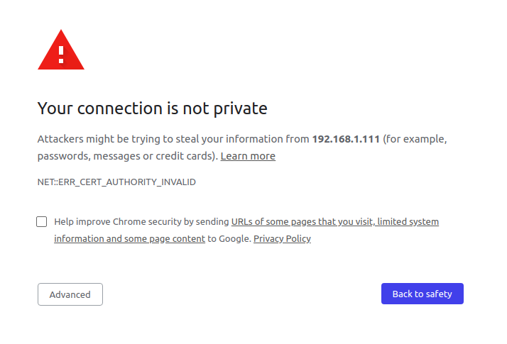

# webrtc
Web realtime communication SDK 


[![Build Status][BS img]][Build Status]
[![Dependency Status][DS img]][Dependency Status]
[![NPM Status][NS img]][NPM Status]

[Gitter]: https://gitter.im/altanai/webrtc?utm_source=badge&utm_medium=badge&utm_campaign=pr-badge 
[Build Status]: https://travis-ci.org/altanai/webrtc
[Dependency Status]: https://david-dm.org/altanai/webrtc
[NPM Status]: https://www.npmjs.com/package/webrtcdevelopment

[GS img]: https://badges.gitter.im/altanai/webrtc.svg
[BS img]: https://api.travis-ci.org/altanai/webrtc.png
[DS img]: https://david-dm.org/altanai/webrtc.svg
[NS img]: https://nodei.co/npm/webrtcdevelopment.png

This is a ready to deploy webrtc SDK and SaaS for a customized and flexible communication and collaboration solution .


## Architecture 
----

The Solution primarily contains nodejs frameworks for hosting the project and webbsockets over socket.io to perform offer - answer handshake and share SDP (Session description protocol ).


### Technologies used 

1. WebRTC 
Web based real time communication framework.
read more on [webrtc](https://altanaitelecom.wordpress.com/2013/08/02/what-is-webrtc/ )


2. Node ( v10.0.0)
Asynchronous event driven JavaScript runtime

3. socket.io ( v0.9)
Communication and signalling 

Note  : while its possible to use any prtotocol like SIP , XMPP , AJAX , JSON etc for this purpose , modifying thsi libabry will require a lot of rework . It would be advisble to start from apprtc directly in that case .  

4. Grunt
It is a task Runner and its used to automate running of command in gruntfile
```
grunt -verbose
```


## SDK
----

Project is divided into 4 parts 

1. Core RTC Conn Lib 
2. Wrappers for the Core Lib containing feature sets and widgets like screensharing , recording , pointer share , machine learning , face detection etc
3. Demo Applicatins like two party full-features , multi-party full features etc which implement and use the SDK by invoking the constructirs , emitters and listeners .
4. SIgnaller over socket.io for SDP excahnge on offer answer model

### Building the SDK

Download the dev dependencies by setting the NODE_ENV to dev . 
This will install all grunt and gulp dependencies used for building the SDK
```
NODE_ENV=development npm install
```

To build the RtcConn , outputs RTCMultiConn
```
grunt rtcconn
```

To build the webrtcdev lib . 
It encapsulates the rtcconn core along with external libs for building various custom features .
Outputs webrtcdevelopment.js , webrtcdevelopment_header.js , webrtcdevelopment.css , webrtcdevelopment_header.css and webrtcdevelopmentserver.js
```
gulp production
```

## Steps 
----

To run this project following steps need to be followed in that order :

**1. Get the project from github**
```
git clone https://github.com/altanai/webrtc.git webrtc
```

**2. install nvm ( node version manager )**
```shell script
curl -o- https://raw.githubusercontent.com/creationix/nvm/v0.31.2/install.sh | bash
. ~/.nvm/nvm.sh
nvm install v12.0.0
nvm use v12.0.0
```

**3. install npm and update the dependencies**
It will read the package.json and update the dependencies in node_modules folder on project location

```shell
sudo apt-get install npm
npm install 
```

**4. Change ENV variables and Test**

To change the ports for running the https server and rest server, goto env.json
```json
{       
    "hostname"      : "host",        
	"enviornment"   : "local",        
	"host"        	: "localhost",
	"jsdebug"      :  true,          
	"httpsPort"    :  8086,
	"restPort"     :  8087
}
```

To run the tests
```shell script
npm test
```

**5. Start up the Server**

To start the Server in dev mode  and stop the server as soon as Ctrl+ C is hit or the terminal widnow is closed . 
```shell script
node webrtcserver.js
```
read more about [node](https://nodejs.org/en/about/ )

To start the Server using npm start ( using package.json) , behaves same as earlier run using node. We use supervisor to restart the server incase of exceptions or new code .
```shell script
npm start
```

**6. JS and CSS Libs**

Make a webpage and give holders for video and button elements that SDK will use .

Inside the head tag of html
    build/webrtcdevelopment_header.css
    build/webrtcdevelopment_header.js

After the body tag of html
    build/webrtcdevelopment.css
    build/webrtcdevelopment.js

or use the minified scripts 
    build/webrtcdevelopment_min.css
    build/webrtcdevelopment_min.js

**7. Configure**

Create the webrtc dom object with local and remote objects

local object  :
```javascript
    var local={

        video           :   "myAloneVideo",            // name of the local video element
        videoClass      :   "",                        // class of the localvideo
        videoContainer  :   "singleVideoContainer",    // outer container of the video element
        userDisplay :       false,                     // do you want to display user details
        userMetaDisplay :   false,
        userdetails:{                                   // users details include name , email , color
            username    : username,
            usercolor   : "#DDECEF",
            useremail   : useremail,
            role        : "participant"                 // role of user in the session , can be participant , admin , inspector
        }
    }
```

remote object  :
```javascript
    var remote={
        videoarr        : ["myConferenceVideo", "otherConferenceVideo"], // conatiners for the video after session is made 
                                                                // first one is usually the local video holder followed by remote video holders
        videoClass      : "",
        maxAllowed      : "6",
        videoContainer  : "confVideoContainer",
        userDisplay     : false,
        userMetaDisplay : false,
        dynamicVideos   : false 
    }

```

Incoming and outgoing media configuration  ( self explanatory ) :
```javascript
    var incoming={
        audio :  true,
        video :  true,
        data  :  true,
        screen:  true
    };

    var outgoing={
        audio :  true,
        video :  true,
        data  :  true,
        screen:  true

    };

    webrtcdomobj= new WebRTCdom(
        local, remote, incoming, outgoing
    );
```

**7. Adding Widgets**

set widgets (explained in section below)
```javascript
    var widgets={     }
```
Set widgets and their properties


**8. Creating session**

Get session id automatically
```javascript
sessionid = webrtcdevobj.makesessionid("reload");
```
or get session name from user
```javascript
sessionid = webrtcdevobj.makesessionid("noreload");
```

**9. Create a session json object with turn credentials and the session created from above step**

set preference for the incoming and outgoing media connection. By default all are set to true . 
```javascript
    var incoming={
        audio:  true,
        video:  true,
        data:   true,
        screen: true
    };

    var outgoing={
        audio:  true,
        video:  true,
        data:   true,
        screen: true
    };
```

**10. finally initiate the webrtcdev constructor**
```javascript
webrtcdevsessionobj = webrtcdevobj.setsession(local, remote, incoming, outgoing, session, getWidgets());       
```

**11. Start the session**
```javascript
 webrtcdevobj.startCall(webrtcdevsessionobj)
```


## Widgets 

Currently available widgets are 
    * Chat 
    * Fileshare
    * Timer
    * Draw
    * Screen Record
    * Screen Share
    * Video Record
    * Snapshot
    * Minimising/ maximising Video
    * Mute (audio and/or video)
    * Draw on Canvas and Sync
    * Text Editor and Sync
    * Reconnect

Description of Widgets with SDK invocation

### 1. Chat 

User RTCDataConnection api from webRTC to send peer to peer nessages within a session. If camera is present the SDK captures a screenshot with user's cemars feed at the isnatnt of typing the message and send along with the message. 

When the chat widget is active  , if the dom specified by the container id is present then webSDK uses as it is,  else it creates one default box 

```json
{
    active: true,
    container: {
        id: "chatContainer"                 // dom id of the chat conatiner 
    },
    inputBox:{
        text_id:"chatInputText",            // dom id of the chta's input box
        sendbutton_id:"chatSendButton",     // dom id for the chat's send button
        minbutton_id:"minimizeChatButton"   // dom id for minimizing the Chat conaginer 
    },
    chatBox:{
        id: "chatBoard"                     // dom id for the chat board where all messages are dispalyed 
    },
    button:{                                // on and off button states for the chat widget button
        class_on:"btn btn-warning glyphicon glyphicon-font topPanelButton",  
        html_on:"Chat",
        class_off:"btn btn-success glyphicon glyphicon-font topPanelButton",
        html_off:"Chat"
    }
}
```
Upcoming : Adding emoticons to Chat

### 2. File-share 

Uses the RTCDataConnection API from WebRTC to exchange files peer to peer. Progress bar is displayed for the chunks of file transferrred out of total number of chunks. Many different kindes of file transfer have been tested such as media files ( mp3 , mp4 ) , text or pdf files , microsoft pr libra office dicuments , images ( jpg , png etc ) etc .

File share widgets creates uses 2 containers - File Share and File List . If the dom ids of the container are not present on the page , the SDK crestes default conainers and appends them to page 

The list of files with buttons to view , hide or remove them from file viewers are in file Viewer container .
Displaying or playing the text or media files happens in file share container , which also has button to maximize , minimize the viewer window or in case of images to rotate them. 

For divided file share container 
```
{
    active : true,
    fileShareContainer : "fileSharingRow",                  // File sharing container
    fileshare:{                                             // components of file sharing container
         rotateicon:"assets/images/refresh-icon.png",       // rotate icon
         minicon:"assets/images/arrow-icon-down.png",       // min icon 
         maxicon:"assets/images/arrow-icon.png",            // max icon
         closeicon:"assets/images/cross-icon.png"           // close icon
    },
    fileListContainer : "fileListingRow",                   // File List container container 
    filelist:{                                              // components of file list conainer 
         downloadicon:"",                                   // icon donwload 
         trashicon:"",                                      // icon trash
         saveicon:"",                                       // icon save
         showicon:"",                                       // icon show
         hideicon:"",                                       // icon hide
    },
    button:{
        id: "fileshareBtn",                                 // dom for widget button to call file share
        class_on: "col-xs-8 text-center fileshareclass",
        html:"File"
    },
    props:{
        fileShare:"divided",                                // Can be divided for two particiapnts , chatpreview  , single for many participants  , hidden 
        fileList:"divided"                                  // same as aboev Can be divided , single   , hidden
    }
}
```
or for single file share container for all peers 
```json
    let filesharewidget = {
        active: true,
        fileShareContainer: "fileSharingRow",
        fileshare: {
            rotateicon: "assets/images/refresh-icon.png",
            minicon: "",
            maxicon: "",
            closeicon: "assets/images/cross-icon.png"
        },
        fileListContainer: "fileListingRow",
        filelist: {
            minicon: "",
            maxicon: "",
            downloadicon: "",
            trashicon: "",
            saveicon: "",
            showicon: "",
            hideicon: "",
            stopuploadicon: ""
        },
        button: {
            id: "fileshareBtn",
            class_on: "file-share",
            html: "File"
        },
        props: {
            fileShare: "single",   //Can be divided , chat preview  , single   , hidden
            fileList: "single"     //Can be divided , single , hidden
        },
        sendOldFiles: false        // If new participant join conf , or listener join , then should he receive old files or not
    }
```

### 3. Timer 

Creates or assigns a timer for teh ongoing sesssion . Also displays the geolocation and timezone of the peers if perssion if provided . Timer can start upwards or downwards. 
Can be used for billing and policy control .

```json
{
    active: true,
    type: "forward",                                        // Forwards timer starts from 0:0:00 goes thereafter, backward timer ticks backword from prespecified time limit
    counter:{                   
        hours: "countdownHours",                            // dom id for hours 
        minutes:"countdownMinutes",                         // dom id for mins
        seconds :"countdownSeconds"                         // dom if for seconds
    },
    upperlimit: {                                           // upperlimit of time for the session 
        hour:0 ,                                            
        min: 3 , 
        sec: 60 
    },
    span:{                                                  // dom ids for local and remote time labels
        currentTime_id:"currentTimeArea",
        currentTimeZone_id:"currentTimeZoneArea",
        remoteTime_id :"remoteTimeArea",
        remoteTimeZone_id:"remoteTimeZoneArea",
        class_on:""
    },
    container:{
        id:'collapseThree',
        minbutton_id:'timerBtn'
    },
    button :{
        id: 'timerBtn'                                      // dom for widget timer button to call
    }
}
```

### 4. Screen Record

Records everything present on the tab selected along with audio and displays recording as mp4 file. Use an extension and pre-declared safe-site  to facilitate captuing the tab.

```json
{
    active : true,
    videoRecordContainer: true,        // container for storing or displaying recorded video
    button:{                           // button to control screen control widget and its on / off states
        id: "scrRecordBtn",
        class_on:"btn btn-lg screenRecordBtnClass On",
        html_on:'',
        class_off:"btn btn-lg screenRecordBtnClass Off",
        html_off: ''
    }
}
```
### 5. Screen-share 

One of the most powerful features of the SDK is to capture the current screen and share it with peer over RTC Peer connection channel. Simmilar to csreen record , uses an extension and pre-declared site ownership to capture the screen and share as peer to peer stream .
Button for screen share has 3 states - 
- install button for inline installation of extension from page , 
- share screen button and 
- view button for incoming screen by peer .

```json
{
    active : true,
    screenshareContainer: "screenShareRow",      // container to display screen being shared
    button:{
        installButton:{                          // widget button to start inline installation of extension
            id:"scrInstallButton",
            class_on:"screeninstall-btn on",
            html_on:"Stop Install",
            class_off:"screeninstall-btn off",
            html_off:"ScreenShare"
        },
        shareButton:{                                       // widget button to start sharing screen , deactivated once already active or when peer is sharig 
            id:"scrShareButton",
            class_on:"btn btn-lg on",
            html_on:'',
            class_off:"btn btn-lg off",
            html_off:'',
            class_busy:"btn btn-lg busy",
            html_busy:''
        },
        viewButton:{                                        // button to view the icnoming screen share 
            id:"scrViewButton",
            class_on:"screeninstall-btn on",
            html_on:"Stop Viewing",
            class_off:"screeninstall-btn off",
            html_off:"View Screen"
        }
    }
}
```

### 6. Video Record 

Records video-stream. Created for each peer video .

```
{
    active : true,
    videoRecordContainer : true,
    button:{
        class_on:"pull-right btn btn-modify-video2_on videoButtonClass on",
        html_on:"<i class='fa fa-circle' title='Stop recording this Video'></i>",
        class_off:"pull-right btn btn-modify-video2 videoButtonClass off",
        html_off:"<i class='fa fa-circle' title='Record this Video'></i>"
    }
}
```

### 7. Snapshot

Takes a snapshot from video stream . Will be created for each inidvidual peer video .

```
{
    active : true,
    snapshotContainer: true,
    button:{
        class_on: "pull-right btn btn-modify-video2 videoButtonClass",
        html_on:"<i class='fa fa-th-large' title='Take a snapshot'></i>"
    }
} 
```

### 8. Minimising/ maximising Video

To enable the user to watch video in full screen mode or to inimize the video to hide it from screen. Will be seprately created for each individual peer video .
    
```
{
    active: true,
    max: {
        button: {                                 // button to maximise the video to full screen mode 
            id: 'maxVideoButton',
            class_on:"pull-right btn btn-modify-video2 videoButtonClass On",
            html_on:"<i class='fa fa-laptop' title='full Screen'></i>",
            class_off:"pull-right btn btn-modify-video2 videoButtonClass Off",
            html_off:"<i class=' fa fa-laptop' title='full Screen'></i>"
        }  
    } ,
    min : {
        button: {                                  // button to minimize or hide the video 
            id : 'minVideoButton',
            class_on:"pull-right btn btn-modify-video2 videoButtonClass On",
            html_on:"<i class='fa fa-minus' title='minimize Video'></i>",
            class_off:"pull-right btn btn-modify-video2 videoButtonClass Off",
            html_off:"<i class='fa fa-minus' title='minimize Video'></i>"
        }  
    }                    
}
```

### 9. Mute (audio and/or video)

Mutes the audio or video of the peer video . Created for each peer video.

```
{
    active: false,
    audio: {
        active: false,
        button: {
            class_on: "pull-right videoButtonClass on",
            html_on: "<i class='fa fa-microphone-slash'></i>",
            class_off: "pull-right videoButtonClass off",
            html_off: "<i class='fa fa-microphone'></i>"
        }
    },
    video: {
        active: false,
        button: {
            class_on: "pull-right videoButtonClass on",
            html_on: "<i class='fa fa-video-camera'></i>",
            class_off: "pull-right videoButtonClass off",
            html_off: "<i class='fa fa-video-camera'></i>"
        }
    }
}
```

### 10 . Reconnect 

Allows a user to recoonect a session without refreshing a page . Will enable him to drop the session and create a new one.

```
{
    active : false,
    button : {
        id: "reconnectBtn",
        class:"btn btn-success glyphicon glyphicon-refresh topPanelButton",
        html:"Reconnect",
        resyncfiles : false
    }
}
```

### 11. Cursor

```
{
    active: false,
    pointer: {
        class_on: "fa fa-hand-o-up fa-3x"
    },
    button: {
        id: 'shareCursorButton',
        class_on: "pull-right videoButtonClass On",
        html_on: "<i class='fa fa-hand-pointer-o fullscreen'></i>",
        class_off: "pull-right videoButtonClass Off",
        html_off: "<i class='fa fa-hand-pointer-o fullscreen'></i>"
    }
}
```

### 12. Inspector 
```
{
    active: true,
    button:{
        id: "ListenInButton",
        textbox : "listenInLink"
    }
}
```
### 13. Debug 

To turn debug on
```
{
  debug: false
} 
```

### 14. Help
Activates the help log by start captures console logs , info , messages , warning in a retreivabe array.
Can also send the logs tto pre-specified URL as paylaod and/or display the logs in dom as specified 
```json
{
  active: true, 
  helpContainer : "help-view-body",
  screenshotContainer: "help-screenshot-body",
  descriptionContainer: "help-description-body"
}
```

### 15. Stats 

Collects network and webrtc stats. Captures them in logs and displays on dom as specified
```json
{
  active : true, 
  statsConainer : "network-stats-body"
}
```

### 16. Draw 
```json
{
    active: true,
    drawCanvasContainer: "drawBoardRow",
    button: {
        id: "draw-webrtc",
        class_on: "icon-pencil On",
        html_on: '',
        class_off: "icon-pencil Off",
        html_off: ''
    }
}
```

### Assign individual widgets to a json object called widgets 

```json
{
    debug: false,
    reconnect: {
        active: false
    },
    timer: timerwidget,
    chat: chatwidget,
    fileShare: filesharewidget,
    mute: mutewidget,
    videoRecord: videorecordwidget,
    snapshot: snapshotwidget,
    cursor: cusrsorwidget,
    minmax: minmaxwidget,
    drawCanvas: drawwidget,
    screenrecord: screenrecordwidget,
    screenshare: screensharewidget,
    listenin: listeninwidget,
    help: helpwidget,
    statistics: {
        active: false,
        statsConainer: "network-stats-body"
    }
}
```

## NAT traversal 

From variety of options you can choose

### 1. Only free STUN from google 
```js
var iceservers_array = [{urls: ["STUN stun.l.google.com:19302"]}];
```

ref : https://stackoverflow.com/questions/20067739/what-is-stun-stun-l-google-com19302-used-for

### 2. Xirsys free account for TURN

### 3. self-hosted COTURN

Goto https://coturn.net/turnserver/ to choose the version you want to download , at the time of writing this 4.5.2 was the latest 
```shell
wget https://coturn.net/turnserver/v4.5.2/turnserver-4.5.2.tar.gz
```
goto https://packages.qa.debian.org/c/coturn.html
the debian coturn package is documented at https://packages.debian.org/jessie/coturn

Install dependencies 
```shell
sudo apt-get install libssl-dev
sudo apt-get install libsqlite3 (or sqlite3)
sudo apt-get install libsqlite3-dev (or sqlite3-dev)
sudo apt-get install libevent-dev
sudo apt-get install libpq-dev
sudo apt-get install mysql-client
sudo apt-get install libmysqlclient-dev
sudo apt-get install libhiredis-dev
```
https://quickref.common-lisp.net/cl-libevent2.html

build
```shell
./configure 
make 
sudo make install
```
After the build, the following binary images will be available:

1.	turnserver
2.	turnadmin
3.	turnutils_uclient
4.	turnutils_peer
5.	turnutils_stunclient.
6.	turnutils_rfc5769check

Adding to signalling server 
```js
var iceservers_array = [{urls: ["STUN stun.l.google.com:19302"]},
    {url: 'turn:user@media.brightchats.com:3478', credential: 'root'}];
```

supported RFC
* RFC 5766 - base TURN specs;
* RFC 6062 - TCP relaying TURN extension;
* RFC 6156 - IPv6 extension for TURN;

## Event listeners 

Implemented event listeners :

1. onLocalConnect

2. onSessionConnect

3. onScreenShareStarted

4. onScreenShareSEnded

5. onNoCameraCard


## Keys and certs 

To generate a CSR for external Certificate Authority such as Godaddy
```shell script
openssl req -x509 -newkey rsa:4096 -sha256 -nodes -keyout ssl_certs/server.key -out ssl_certs/server.crt -subj "/CN=webrtc.altanai.com" -days 3650
```

## Demo

open tab on chrome or mozilla browser and add a link to the https server using nodejs script
https://127.0.0.1:8086/multiparty_fullfeatures.html

Other implementation of the SDK are 

webrtc_quickstart - https://github.com/altanai/webrtc_quickstart

webrtc_usecases - https://github.com/altanai/webrtc_usercases


## Extra 

Following are the additional libraries packed with the project 

**Gulp**
Minify and concat the js and css files  into minified scripts

**Task Runner**
you can run gulp alone to minify and concat the js and css files  into min-scripts
```
gulp
```
or can run grunt to concat , minifify , ugligy , push to git and npm all together 
```
grunt production 
```

**forever**
Keeps running even when window is not active 
```
cd WebCall
forever start webrtcserver.js
```
**Notification / Alerting**

//tbd

**creating doc**
```
 ./node_modules/.bin/esdoc
  open ./docs/index.html
```

### start with process manager pm2 


To start the Server using PM2 ( a process manager for nodejs) , install pm2 globally 
```shell script
npm install pm2 -g
```

create a conf json 
```shell script
pm2 ecosystem
```

Add config to json 
```json
  apps : [{
    script: 'webrtcserver.js',
    watch: '.'
  }]
```
start pm2 
```shell
pm2 start ecosystem.config.js 
```
**with env**
```shell
pm2 start ecosystem.config.js --env production
```

----------------------------------------------------------
## Working steps 

**1.create a new session**

Navigate on browser https://localhost:8082/#2435937115056035
which creates websocket over socket.io wss://localhost:8083/socket.io/?EIO=3&transport=websocket

**2.check for channel presence**

first client message 
```shell script
[ "presence", 
  {
    channel: "2435937115056035"
    }
 ]
```

on the server side 
```
 Presence Check index of  2435937115056035  is  false
```
websocket response from server ["presence", false]

**3.If channel doesnt exist already create**

client message to open channel 
```shell script
  [  "open-channel", 
    {
      channel: "2435937115056035", 
      sender: "gxh0oi2jrs", 
      maxAllowed: 6
     }
   ]
```

server response 
```shell script
 ------------open channel-------------  2435937115056035  by  gxh0oi2jrs
registered new in channels  [ '2435937115056035' ]
information added to channel { '2435937115056035':
   { channel: '2435937115056035',
     timestamp: '12/18/2018, 10:18:01 PM',
     maxAllowed: 6,
     users: [ 'gxh0oi2jrs' ],
     status: 'waiting',
     endtimestamp: 0,
     log:
      [ '12/18/2018, 10:18:01 PM:-channel created . User gxh0oi2jrs waiting ' ] } }
     
```

websocket response from server
```shell
  [  "open-channel-resp", 
   { 
    status: true, 
    channel: "2435937115056035"
    }
  ]
```
    
**4.Join a session and check for channel presence**
  
  navigate another browser client to same session url such as https://localhost:8084/#2435937115056035?name=aa&email=abc@gmail.com
```shell 
   check presence ["presence", {channel: "2435937115056035"}]
   
   ["presence", true]
  
   Presence Check index of  2435937115056035  is  true
```  
   
**5.If channel is present join the channel**

```shell script
  ["join-channel", {channel: "2435937115056035", sender: "2ilwvn9qq39",…}]
   
------------join channel-------------  2435937115056035  by  2ilwvn9qq39  isallowed  true

[ "join-channel-resp"
 {
 status: true, 
 channel: "2435937115056035", 
 users: ["gxh0oi2jrs", "2ilwvn9qq39"]
}]
```
 
## Debugging help

### getusermedia Exceptions

Cases when user deosnt have ir isnt able to acces his audio/video devices due of any of reasons such as 
- user has no webcam or microphone
- intentioanlly/accidentally denied access to the webcam
- plugs in the webcam/microphone after getUserMedia() code has initialized
- device is already used by another app on Windows
- user dismisses the privacy dialog

Rejections of the returned promise are made by passing a DOMException error object to the promise's failure handler. 
The DOMException interface represents an abnormal event 

Possible errors are:
```json
openrmc.webrtc.Errors = {
    NOT_SUPPORTED : 'NOT_SUPPORTED',
    CONSTRAINTS_REQUIRED : 'CONSTRAINTS_REQUIRED',
    AUDIO_NOT_AVAILABLE : 'AUDIO_NOT_AVAILABLE',
    VIDEO_NOT_AVAILABLE : 'VIDEO_NOT_AVAILABLE',
    AV_NOT_AVAILABLE : 'AV_NOT_AVAILABLE'
} ;
```

* AbortError - Although the user and operating system both granted access to the hardware device, and no hardware issues occurred that would cause a NotReadableError, some problem occurred which prevented the device from being used.

* NotAllowedError - One or more of the requested source devices cannot be used at this time. This will happen if the browsing context is insecure (that is, the page was loaded using HTTP rather than HTTPS). It also happens if the user has specified that the current browsing instance is not permitted access to the device, the user has denied access for the current session, or the user has denied all access to user media devices globally. On browsers that support managing media permissions with Feature Policy, this error is returned if Feature Policy is not configured to allow access to the input source(s).
Older versions of the specification used SecurityError for this instead; SecurityError has taken on a new meaning.

* NotFoundError - No media tracks of the type specified were found that satisfy the given constraints.
NotReadableError
Although the user granted permission to use the matching devices, a hardware error occurred at the operating system, browser, or Web page level which prevented access to the device.

* OverconstrainedError - The specified constraints resulted in no candidate devices which met the criteria requested. The error is an object of type OverconstrainedError, and has a constraint property whose string value is the name of a constraint which was impossible to meet, and a message property containing a human-readable string explaining the problem.
Because this error can occur even when the user has not yet granted permission to use the underlying device, it can potentially be used as a fingerprinting surface.

* SecurityError - User media support is disabled on the Document on which getUserMedia() was called. The mechanism by which user media support is enabled and disabled is left up to the individual user agent.

* TypeError - The list of constraints specified is empty, or has all constraints set to false. This can also happen if you try to call getUserMedia() in an insecure context, since navigator.mediaDevices is undefined in an insecure context.

ref : https://developer.mozilla.org/en-US/docs/Web/API/MediaDevices/getUserMedia

### Errors on gulp 

**sourcemap related**
USe gulp-babel@8.0.0

**arrow functions realted**
use tarnscompiler with preset env plugin for changes arrow function to normals ones before minifying

### WSS errors

**Issue1** net::ERR_CONTENT_LENGTH_MISMATCH 200 (OK) 
\
**solution** This error is definite mismatch between the data that is advertised in the HTTP Headers and the data transferred over the wire.
 It could come from the following:
Server: If a server has a bug with certain modules that changes the content but don't update the content-length in the header or just doesn't work properly. It was the case for the Node HTTP Proxy at some point (see here)
Proxy: Any proxy between you and your server could be modifying the request and not update the content-length header. 


**Issue2**  wss error connecting to webrtcserver like 
```json
{"code":3,"message":"Bad request"} 
```
or
```shell script
Error: read ECONNRESET
Emitted 'error' event on TLSSocket instance at:
    at emitErrorNT (internal/streams/destroy.js:84:8)
    at processTicksAndRejections (internal/process/task_queues.js:84:21) {
  errno: -104,
  code: 'ECONNRESET',
  syscall: 'read'
}
``` 
\
**Solution** ECONNRESET error means that peer closed connection https://nodejs.org/api/errors.html .
To overcome this example either set try catch and reconnect to prevent sever from crashing or client from disconnectinig 
or if you are running the http and wss server on the sae port like i was doing . Put them on seprate ports . 
I started seeing this problem a lot after I upgraded the http protocol version from https to http2 ( using native node module )  
for example for http server 
```javascript
const app = http2.createSecureServer(options, (request, response) => {
    request.addListener('end', function () {
        file.serve(request, response);
    }).resume();
});
app.listen(properties.http2Port);
```
the again declare it seprately for wss server 
```javascript
const server = require('http2').createSecureServer(options);
const io = require('socket.io')(server, {
    secure: true,
    serveClient: false,
    pingInterval: 10000,
    pingTimeout: 5000,
    cookie: false
});
io.origins('*:*');
io.on('connect', onConnection);
server.listen(properties.wss2Port);
```

**Issue 3** WSS errors on socket.io as, error in connection establishment: net::ERR_SSL_PROTOCOL_ERROR \
or  WebSocket opening handshake was cancelled
\
**solution** recheck the session connection to socket.io , especially the ports and whther or not they are already in use 


**Issue 4** Error during WebSocket handshake: Unexpected response code: 403 
\
**solution** Related to ECONNRESET


**Issue 5** {code: 0, message: "Transport unknown"}
            code: 0
            message: "Transport unknown"
or 
Status Code: 400 Bad Request
\
**solution** Either specify same protocol on both client and servers ide or do not specify and transport protocol at all .
For isntance this problem arises  when server specifies websocket transport but client tries connecting over polling 
server specifying tarsnport websocket
```javascript
ioServer(httpApp,{
    transports: ['websocket'],
    secure: true
})
```
But client tries polling connection
https://localhost:8086/socket.io/?userid=iu02bk1b77g&sessionid=httpslocalhost8082clientindexhtm&transport=polling&t=N7ToS63


### errors on SSL certs 
    
**Issue 6** CERT INVALID ERROR such as     
```shell script
NET::ERR_CERT_AUTHORITY_INVALID
````
\
**Solution** Since the certs are self signed , navigate to the wss port on http and allow permission under teh advanced button in scren below 



**Issue 7** GoDaddy SSL ecrts key gives no start line     
```shell script
  library: 'PEM routines',
  function: 'get_name',
  reason: 'no start line',
  code: 'ERR_OSSL_PEM_NO_START_LINE'
````
\
**Solution** first check whether the key file has valid certificate 
```shell script
openssl x509 -text -in file.key
```
Check if it prints an error including the text "unable to load certificate", then your file is not sufficient.
See if the format is correct 
```shell script
openssl pkcs8 -in key.txt  -inform pem
Error reading key
140542854250944:error:0909006C:PEM routines:get_name:no start line:../crypto/pem/pem_lib.c:745:Expecting: ENCRYPTED PRIVATE KEY  
```
If not then re-save the file with charectar encoding UTF-8 and Line ending Unix/Linux 
       
### Errors on TURN 

**Issue 1** Pass issues on starting coturn
```
CONFIG ERROR: Empty cli-password, and so telnet cli interface is disabled! Please set a non empty cli-password!
0: : WARNING: cannot find certificate file: turn_server_cert.pem (1)
0: : WARNING: cannot start TLS and DTLS listeners because certificate file is not set properly
0: : WARNING: cannot find private key file: turn_server_pkey.pem (1)
0: : WARNING: cannot start TLS and DTLS listeners because private key file is not set properly
```
**solution** use no-auth in config or cli 


**Issue 2**
```
0: : NO EXPLICIT LISTENER ADDRESS(ES) ARE CONFIGURED
0: : ===========Discovering listener addresses: =========
0: : Listener address to use: 127.0.0.1
0: : Listener address to use: 172.31.13.206
0: : Listener address to use: ::1
```
**Solution** Happens on ec2 container. Map the exteral initernal specifically in conf ot cli
```shell
turnserver -X EXT_IP/INT_IP 
```
or in config `external-ip=EXT_IP/INT_IP`


**Issue 3** Assigning address 
```shell
errno=99
Cannot bind local socket to addr: Cannot assign requested address
```
**solution** Check if the ports are open 
```shell
ps -ef | grep 3478
```
and kil any processes that may be found running 
ref : https://github.com/coturn/coturn/issues/311

**Issue 4** Both username and credential are required when the URL scheme is "turn" or "turns". at new WrappedRTCPeerConnection
```json
var iceservers_array = [{urls: 'stun:stun.l.google.com:19302'},
    {url: 'turn:user@media.brightchats.com:3478', credential: 'root'}];
```
**Solution**
```json

```
    
### Errors on git

update registry to  "registry": "https://registry.npmjs.org " 
shelved

## Reporting a Vulnerability

Create an issue
https://github.com/altanai/webrtc/issues <https://github.com/altanai/webrtc/issues>

### License

MIT

Todo:
remove topIconHolder_ul
